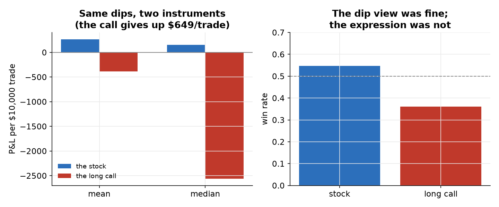
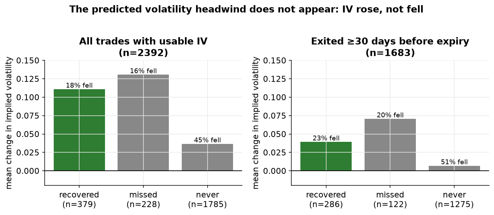
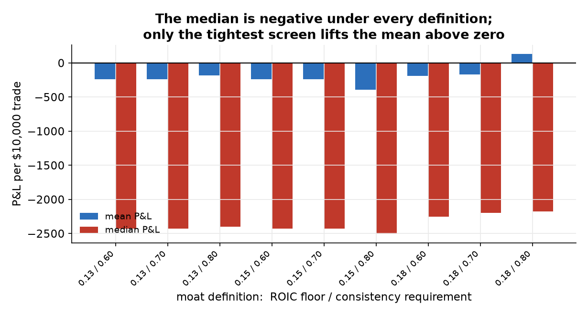

# Buying Dips in Wide-Moat Names, Expressed as Long Calls

**Claim audited.** Dips in high-quality, wide-moat companies can be bought profitably, and the long call is the natural way to express it: loss is capped at the premium, so it is the defined-risk form of catching a falling knife. A practitioner thesis rather than a published paper — the kind of claim that is acted on far more often than it is tested.

**Verdict.** A clean negative, and a more specific one than expected. Across a point-in-time wide-moat universe the strategy loses $263 per trade on average and $2,428 at the median, net of realistic option costs. But the same dips bought in the underlying are roughly flat to positive, so what fails is the instrument, not the thesis. The failure is time, not volatility: the expiry clock and decay, and in deep panics the direction of the underlying itself — while the implied-volatility headwind that the strategy was expected to die from does not appear in the data at all.

## What is audited, and how it is re-derived

The trade record contains 2,392 dip purchases across 38 wide-moat names between
2014 and 2024, each expressed as a long call priced from real daily option chains, each
sized to a uniform $10,000 so that strikes are comparable in dollars rather than in
percentages. A dip is defined in volatility-normalized units — a drawdown from the
trailing high divided by the name's own volatility — so that "a dip" means the same
thing in a quiet name and a violent one; entry is at two standard deviations, and three
or beyond is classified as a deep panic. Two strikes (0.40 and 0.80 delta) and four exit
rules are carried through the whole study rather than chosen early.

Re-deriving this record through the framework begins with not trusting it. Contract
counts and dollar P&L recomputed from primitives match the record exactly
(0 mismatches; every trade reproduces to the cent). The point-in-time moat universe, rebuilt from raw
fundamentals with a persistence screen — return on invested capital above 15% in at
least 70% of the trailing eight years, plus a stable gross margin — reproduces
211 of the 216 stored (year, name) pairs.
The 5 it cannot confirm (2014 MA, 2015 MA, 2016 MA, 2016 MON, 2018 MON)
are gaps in the exported fundamentals rather than disagreements about the screen: the
exported file carries no gross margin for Mastercard before 2009 and only two rows for
Monsanto. No record used in an as-of decision carries a later timestamp.

## Headline

The strategy loses. The average trade returns -$263 on a $10,000
outlay, the median -$2,428, with a win rate of 0.36. The gap
between mean and median is the shape of the whole result: most trades lose most of the
premium, and the average is dragged toward zero by a minority of large rebounds.

Three-quarters of trades — 1,785 of 2,392 (75%) —
never see the underlying regain its pre-dip high before the position is closed. A
further 228 (10%) do reach it at some point during
the hold but have given it back by exit, and 379
(16%) are still above it when the position closes.

## The instrument, not the thesis

The same entries and exits, expressed in the underlying shares rather than in calls,
average $263 with a median of $150
and a win rate of 0.55. Against the call's
-$386 on the same trades, the option expression gives up
$649 per trade. Even when the stock position wins, the
call wins only 65% of the time.

The dip-buying decision is not what fails. Buying the instrument is roughly flat to
positive; buying the option on it is not.

This comparison covers 1,917 of the 2,392 trades — an exit price
for the underlying is not recorded for the remaining 475,
which are trades closed at or near expiry. Those excluded trades averaged
$235 for the option, *better* than the
-$386 average of the covered set, so the measured drag
is the pessimistic end of the range rather than the flattering one.

## The clock, not the thesis

Three-quarters of trades never saw the underlying regain its pre-dip high before the
position closed. That is a statement about the holding window, not about whether the dip
came back — and the distance between those two statements is the whole diagnosis.

The original study settled it with a probe: for each of the 282
distinct dip events whose underlying never recovered before exit, did the stock return to
the entry price within a year *after* the position was closed?
247 of 282 (87.6%) did. The
dips largely came back. The calls had already expired.

Two guards on that number, and both are load-bearing. It measures recovery to the entry
price rather than to the pre-dip high, which was not retained per trade; the entry price
is the easier level, so 88% is an upper bound. And a recovery inside a year
does not mean a longer-dated call would have profited, because a longer hold pays more
theta. What it establishes is that the clock missed the recovery — not that removing the
clock would print money.

The probe needs daily equity history from the data vendor's platform, so it cannot be
re-run here, and its printed output was never written to disk: it was recovered from the
transcript of the session that produced it. A recovered number is worth what its link to
the data is worth, so the link is checked rather than asserted — deduplicating this trade
record's never-recovered trades to unique dip events reproduces the probe's denominator
exactly (282 events). The figure demonstrably belongs to the data
pinned in `data/`, and it is pinned there itself, with its provenance, in
`data/option_clock_probe.json`.

## The volatility headwind that was not there

The prior going in — the reason both strikes were carried through the study — was a
double headwind. Implied volatility is elevated when a dip is bought, so the call is
expensive; then, as the name recovers, volatility mean-reverts downward and the position
gives back more through vega. It is a clean, plausible story, and the record refutes it.

The entry and exit implied volatilities of the traded contracts are in the data, so the
test needs no model. Across trades closed at least thirty days from expiry — where a
fixed-strike volatility comparison is least distorted by the skew and the term structure
— the average change in implied volatility is
+0.017, and on the trades where the underlying *did* recover it is
+0.039, with volatility falling in only
23% of them. Volatility rose on the way
back more often than it fell.

A modelled decomposition sizes the three effects. Reconstructing each contract's strike
from its entry delta and splitting the P&L into delta, vega and theta gives, per trade:
delta $1,656, vega
$1,825, theta -$2,615. Time
decay is the one term that is reliably against the position; vega is, on average, mildly
*for* it. In deep panics the picture changes character — delta becomes
-$4,536 as the underlying keeps falling, and
direction, not volatility, is what does the damage.

This decomposition is modelled and its levels are not trustworthy: it reproduces the
price actually paid at entry closely (correlation
0.918, median ratio
0.965) but overstates total P&L by
$1,816 per trade, because the
reconstructed strike is not the exact contract and mid-based pricing is not the price
traded. Its signs, however, are not modelled at all — they follow the observed movements
of price and implied volatility — which is what the argument above rests on.

## Which strike, and when it matters

On moderate dips the two strikes are close: -$170 for the
in-the-money call against -$218 for the out-of-the-money one. In
deep panics they separate sharply — -$2,664 against
-$4,596 — and the in-the-money structure is materially less bad. The
answer to "which strike" is therefore conditional on how deep the dip is, which is why
both were carried to the end instead of one being dropped early on the moderate-dip
evidence. The deep-panic sample is 48 trades; the ordering is directional, not precise.

## Does the conclusion survive the definition?

The conclusion should not depend on where exactly the moat line is drawn, so the
universe definition is swept: the return-on-capital floor across 13%, 15% and 18%, and
the consistency requirement across 60%, 70% and 80%, for 9 definitions in
total.

The median trade is negative in all 9 — between
-$2,506 and -$2,177 — and the win rate stays between
0.36 and 0.39, never approaching one half. The share of dips
that never recovered before exit stays near three-quarters throughout.

One cell does break, and it is reported rather than smoothed over. Under the tightest
screen (ROIC at least 18% in at least 80% of years), which keeps only
1,376 of the 2,392 trades, the *mean* turns positive
at $132 while the median stays at
-$2,177. That is the same mean-versus-median
asymmetry as the headline, concentrated: a smaller, higher-quality sample keeps its
handful of large rebounds while losing many of the small losers. It does not overturn
the verdict — a strategy whose median trade loses $2,177
is not a strategy — but anyone reading only the mean would reach a different conclusion
in that corner, and they are entitled to know it.

Looser definitions admit names that were never backtested
(AMGN, EMR, GD, INTC, ITW, MDT, META, NOC, PG, SYK, UNH). They are listed rather than folded in: the
conclusion covers the trades that were actually run, and extending it to names for which
no trade exists would be claiming evidence that was never gathered.

## Honest limitations

- The option-clock figure (87.6%) is recovered, not recomputed. The probe needs daily equity history from the data vendor's platform; its printed output was never saved and was recovered from the transcript of the session that ran it. It is pinned with its provenance in `data/option_clock_probe.json`, and only its denominator is verified locally (282 dip events, matching the probe exactly). A reader who wants the number re-derived rather than traced needs that platform.
- That figure measures recovery to the entry price rather than to the pre-dip high, which was not retained per trade, so it is an upper bound. It also does not imply that a longer-dated call would have profited — a longer hold pays more theta. It establishes that the clock missed the recovery, nothing more.
- The P&L decomposition into delta, vega and theta is modelled: the strike is reconstructed from the entry delta and prices come from Black-Scholes at the recorded implied volatilities. It overstates P&L by $1,816 per trade in level and should be read for composition only. The volatility conclusion itself does not depend on it — that rests on the recorded entry and exit implied volatilities directly.
- A fixed-strike implied-volatility comparison across time also moves along the skew and the term structure. The effect is largest near expiry, which is why the volatility test is reported on trades closed at least thirty days out; it is reduced there, not eliminated.
- The stock-versus-call comparison covers 1,917 of 2,392 trades, because an exit price for the underlying is not recorded for positions closed at expiry.
- The deep-panic subsample is 48 trades. The strike ordering it implies is directional and should not be read as a precise estimate.
- The moat screen uses restated historical fundamentals rather than the originally-reported figures, a mild look-ahead that the persistence requirement smooths but does not remove. The exported fundamentals are also thinner than the source used originally, which is why 5 stored universe memberships cannot be re-derived here.
- Transaction cost is an implied-volatility-scaled spread standing in for a real bid-ask, which the free daily option data does not carry. Deep-panic costs are therefore modelled, not observed.
- This audits the long call. It does not test spreads, longer-dated options, or the same thesis expressed with a different structure — each of which would be a separate claim.

## What would have changed the verdict

The harness is not built only to find nulls, and this case had several ways to come out otherwise. Had the option expression been sound, the call's P&L would have tracked the underlying's instead of trailing it by $649 per trade. Had the volatility headwind been the killer, implied volatility would have fallen on recovering trades; it rose. Had the verdict been an artefact of where the moat line was drawn, the sweep would have shown the median crossing zero somewhere in the grid; it never does. And had the record itself been unsound, the accounting audit would have failed rather than reproducing every trade to the cent.

## Provenance and reproduction

- Trade record, moat universe and fundamentals are the exported artefacts of the original study (option chains: daily, 2012 onward, with implied volatility and Greeks); they are pinned in `data/`.
- Reproduce with `micromamba run -n verdict python cases/buy_the_dip/run.py`, then `make_figures.py`, then `make_report.py`. All offline, all CPU, seconds.
- Every number in this document is interpolated from `results.json`; none is typed in by hand.
- Framework components exercised: `costs.budget_pnl` (accounting audit), `pointintime.persistent_quality` and `universe_asof` (universe rebuild), `pointintime.audit_no_future_rows` (look-ahead audit), `diagnose.expression_vs_underlying` (instrument playbook), `options.pnl_attribution` (decomposition), `robust.sweep` and `robust.conclusion_stability` (robustness).
