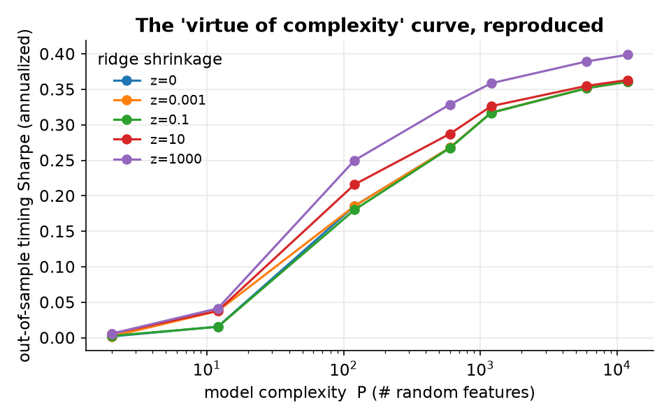
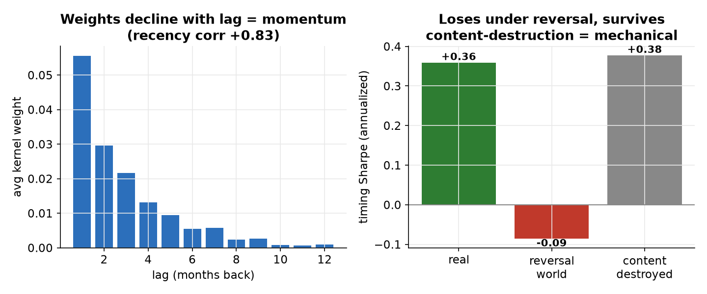
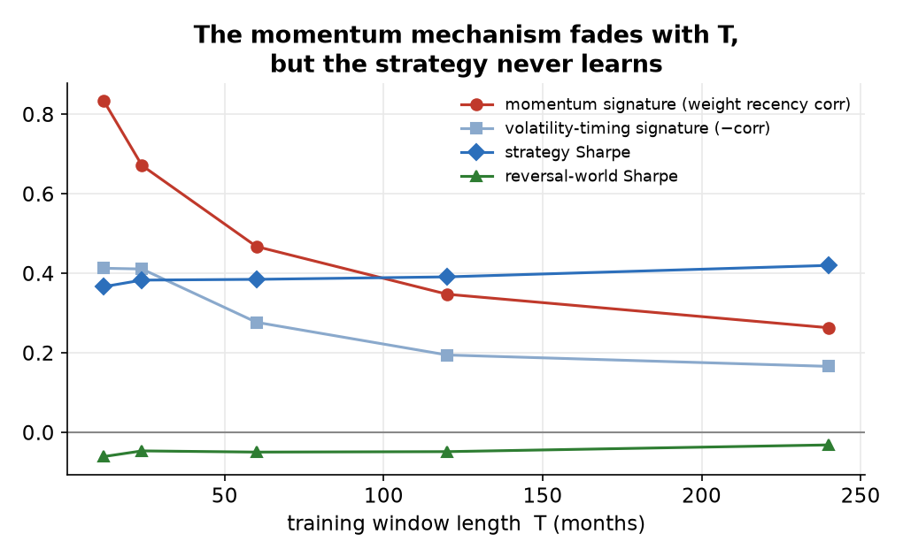

# Verdict — The Virtue of Complexity in Return Prediction

**Claim audited.** Kelly, Malamud, and Zhou (2024, *Journal of Finance*) report that a
massively over-parameterized return-prediction model — 12,000 random Fourier features
built from 15 predictors, fit by ridgeless regression in rolling windows as short as
twelve months — times the market out of sample, with performance that *rises* as the
model grows more complex. It is a striking claim: conventional wisdom holds that
extracting signal from noisy, persistent predictors needs decades of data, not one year.

**Verdict: the benefit is a mechanical artifact, not a learned signal.** Reproduced
end-to-end and put through three independent diagnostics, the complex model reduces, in
its headline configuration, to a twelve-month volatility-timed momentum rule. It builds
the same momentum positions on data where momentum has been replaced by reversal (and
duly loses), and it performs just as well after the predictors' information has been
destroyed. The complexity is not learning; it is a mechanism. This is the reading of
Nagel (2025), and all three of our diagnostics confirm it.

## The setup, reproduced

Data are anchored to the original authors' own inputs (the `GYdata.mat` distributed
with their code): every one of the fifteen predictors and the return target matches at
a correlation of 1.0000 (book-to-market at 0.999, a known data-vintage difference). On
this data the "virtue of complexity" curve reproduces cleanly: the annualized timing
Sharpe ratio rises from essentially zero at two features to about 0.36 at twelve
thousand, at every level of ridge shrinkage including none. Two hallmarks of the
original appear unforced: the out-of-sample R-squared stays *negative* even as the
timing Sharpe is solidly positive, and the interpolation threshold at c = P/T = 1
produces a wild variance spike in the forecasts — the double-descent singularity, visible
in the raw numbers.

## Three diagnostics, one mechanism

**It is a kernel smoother in disguise.** In the limit of many features, ridgeless RFF
regression is identical to ridgeless regression with a Gaussian kernel, whose forecast
is a weighted average of the training-window returns with weights fixed entirely by
predictor similarity — never by the returns themselves. Computed directly on the real
data, the kernel forecast is numerically indistinguishable from the RFF forecast
(correlation 0.997) and spans the strategy's returns almost completely (R-squared 0.995,
residual alpha t = −0.85). The implied weights decline with lag — recent months carry
more weight, which is momentum — and their overall scale falls when the predictors are
volatile, which is volatility timing. The twelve-thousand-parameter model is a
twelve-month volatility-timed momentum rule.

**It does not learn.** Inject a strong reversal component into the returns, so that the
data now rewards betting *against* recent moves, and re-run the whole pipeline. The
strategy builds the same momentum positions and loses: the Sharpe ratio flips from +0.36
to −0.085, negative in eight draws out of eight. It never learned that momentum was
present in the original data; it manufactures momentum regardless of what the data
rewards.

**It does not use the information.** Destroy the predictors' predictive content with a
wild bootstrap that preserves their persistence and volatility, and the performance is
unchanged — +0.36 becomes +0.378. Whatever drives the result, it is not information in
the predictors.

## The boundary: the mechanism is loudest where the claim is loudest

Nagel's critique is aimed at the short-window regime, and the phase diagram
shows why. As the training window grows from twelve to two hundred and forty
months, the momentum fingerprint in the kernel weights fades steadily — the
correlation between weight and recency falls from 0.83 to 0.26, and the
volatility-timing signature weakens with it (from −0.41 to −0.17). With more
history the kernel is no longer forced to lean on the last handful of months.

But longer windows do not rescue the "virtue" into genuine learning. Across the
whole range the strategy's Sharpe barely moves (0.37 to 0.42), and injected
reversal still turns it negative at every window length. Growing the training
window dilutes the momentum mechanism without replacing it with real predictive
content. The complexity benefit is loudest at a twelve-month window precisely
because that is where the mechanical momentum is cleanest — not where learning
is strongest. That the headline result lives at T = 12 is not incidental; it is
the tell.

(The kernel forecast used to trace this boundary is a faithful stand-in for the
full model: at T = 12 and T = 60 it correlates with the twelve-thousand-feature
RFF forecast at 0.985 and 0.930 respectively.)

## Honest limitations

- A deliberately simplified momentum proxy — fixed linearly-declining weights scaled by
  inverse predictor volatility — spans only about ten percent of the strategy and leaves
  a significant residual alpha (t = 2.45). This is *not* evidence against the mechanism;
  it is evidence that a crude proxy is not the mechanism. The rigorous demonstration is
  the kernel forecast above, which is exact. Both are reported rather than only the one
  that looks tidy.
- The reversal and bootstrap constructions use pinned default parameters; their exact
  form should be reconciled against Nagel's appendix, though the qualitative results
  (sign flip; invariance) are not delicate.
- The original construction carries minor look-ahead ambiguities — inflation is used
  contemporaneously despite a one-month reporting lag, and the replication convention
  standardizes returns with a window that includes the current month — each worth roughly
  0.02–0.04 of Sharpe at high complexity. The phenomenon survives either convention; our
  default is the strictly-backward one.
- This audits the headline market-timing configuration. It does not test the
  cross-sectional or SDF variants claimed elsewhere in the same research program, which
  would be separate cards.

## What would have changed the verdict

The harness is not built only to find nulls. Its known-answer gates include a planted
nonlinear signal that a linear model cannot see and the RFF model does — and the RFF
model detects it. Had the market data contained genuine nonlinear structure that the
complex model was learning, the kernel forecast would not have spanned it, the reversal
world would not have flipped it, and the bootstrap would have destroyed it. None of that
happened.
