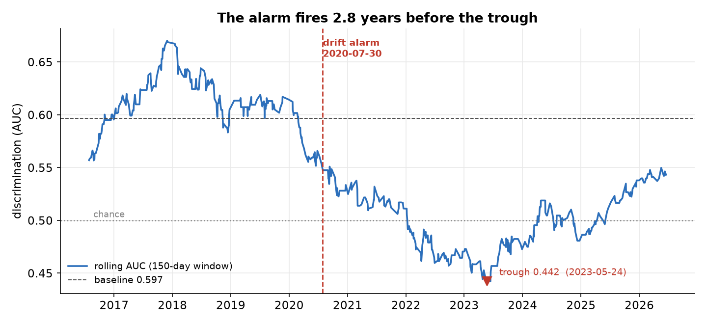
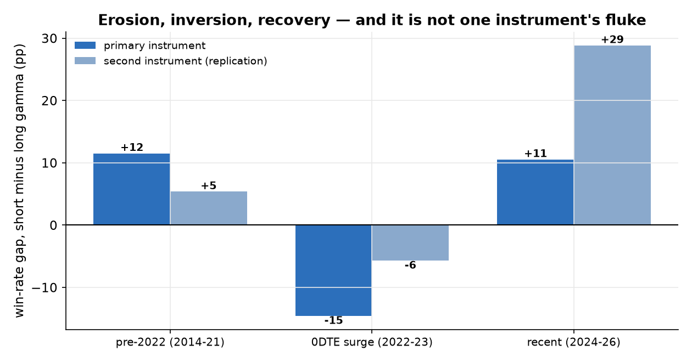
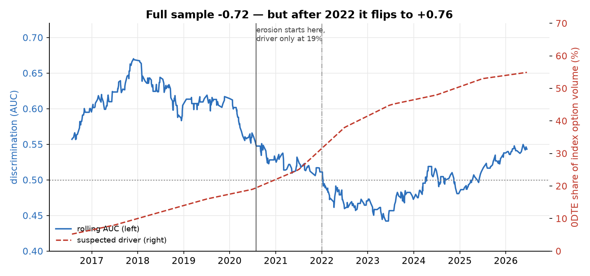

# A Live Signal That Decayed: Detecting It, Dating It, and Resisting the Easy Cause

**Claim audited.** A dealer-gamma reading discriminates between winning and losing days for an intraday trading rule — a claim about a feature deployed in production, not about a backtest. The audit asks three things of it: did the discrimination decay, when could that have been known, and what caused it.

**Verdict.** Decayed, detectable early, and not explained by the obvious suspect. Discrimination fell from a baseline of 0.597 to 0.442 — below chance — and partially recovered to 0.548. The change-point detector dated the onset 2.8 years before the trough. The same-day-expiry boom, which correlates with the decay at -0.72 over the full sample, fails the split test: the erosion began while adoption was still at 19%, and discrimination recovered while adoption kept rising, flipping the correlation to +0.76.

## What is audited

The subject is not a strategy but a *feature*: a dealer-gamma reading used to predict
whether an intraday trading rule — taken from a separate intraday-momentum study — would
win or lose on a given day. The prediction stream is 700 traded days from
2014-01-23 to 2026-06-17, each carrying a score and a realized
binary outcome.

The model under test is deliberately a one-line rule: negative gamma reading predicts a
win. That is not a limitation, it is the design. A complicated model would make the decay
harder to attribute, and the question here is not how well one can predict — it is how
one *notices*, on time, that a deployed predictor has stopped working, and what one is
entitled to conclude about why.

Everything below is re-derived from the pinned data by the framework. Against the
original study's saved rolling series the re-derivation matches on all
551 windows at a correlation of 1.000000 with a maximum
absolute difference of 2e-16 — floating-point noise.

## Detection: the alarm, and how early

Rolling discrimination starts at a baseline of 0.597 — modest, which is
the honest description of a real but weak edge — and ends at a trough of
0.442 on 2023-05-24, below chance. Between those two
points the signal did not merely weaken; it inverted, and for a stretch the rule was
worth betting against.

The change-point detector fires on 2020-07-30, when rolling discrimination
had fallen to 0.548 — **2.8 years before the trough**. That
lead is the entire practical point of a monitor. A chart of the decay is available to
anyone at any time; what a deployed model needs is a dated alarm early enough to act on,
and a detector conservative enough that it did not cry wolf during the earlier dips.

## The shape, and whether it is one instrument's fluke

Cut into phases, the shape is erosion, inversion, recovery — and the inversion is not
subtle. Before 2022 the rule's short-gamma days won +12 percentage points
more often than its long-gamma days (AUC 0.562). Through 2022–23 the gap
becomes -15pp — the sign flips, the long-gamma days win more, and AUC
falls to 0.476. From 2024 the original edge returns at
+11pp and AUC 0.548.

The bootstrap bands are wide — the pre-2022 AUC interval is
[0.515, 0.603] and the recovery interval
[0.492, 0.605] — and they should be reported at that
width. On roughly 445 and 134 observations, with an effect this size,
the intervals brush against chance. The claim being made is about the *shape* and its
timing, not about a precisely estimated level.

The same shape appears on a second instrument, independently: +5pp,
then -6pp, then +29pp. Weaker and noisier in the
first two phases and considerably stronger in the third, but the sign pattern is the same
one — so this is not one ticker's fluke.

## Attribution: the tempting cause that does not hold

The obvious explanation is the explosion of same-day-expiry options over this period,
which plausibly makes an end-of-day gamma snapshot a stale measurement of what dealers
are actually hedging. Over the full sample the rank correlation between discrimination
and that adoption series is -0.72. It is a compelling number, and it
does not survive contact with the timing.

The decay began at the alarm date, when the suspected driver stood at only
19% — the erosion starts *before* the surge. And
discrimination recovered from the trough while the driver kept climbing to
55%: within the post-2022 window the correlation is
+0.76, the opposite sign. A cause that explains neither the onset nor
the recovery is not a cause; it is a coincidence over an interval where both series
happened to move.

The verdict is deliberately untidy: same-day expiry coincides with the inversion phase
and may well have deepened it, but it explains neither end of the story. A single-cause
account is not supportable from this data, and the framework's split test is what makes
that statable rather than merely suspected.

## Honest limitations

- The signal is weak throughout. The strongest phase reaches AUC 0.562 with a bootstrap interval of [0.515, 0.603]; the recovery phase interval [0.492, 0.605] includes values close to chance. Every statement here is about a small effect on a few hundred observations, and none of it should be read as a strong predictor.
- The phases contain 121 and 134 observations. A phase-level win-rate gap on samples that size is an indication, not an estimate.
- The adoption series is annual, anchored on published figures with intermediate years interpolated, then placed mid-year and interpolated to daily. That is adequate for an overlay and inadequate for anything finer; the split test depends on the ordering of the series, not on its exact daily level.
- Rank correlations between two smooth, strongly trending series are inflated by the trend itself. This is precisely why the full-sample -0.72 is not treated as evidence — the split is the test, and it is a weak one in absolute terms.
- Ruling out one candidate cause is not identifying the true one. What actually changed remains unknown; the honest output is a dated decay, a replicated shape, and one explanation eliminated.
- The detector's parameters (window length, CUSUM slack and threshold in baseline standard deviations) were set in the original study and are used here unchanged. They were not re-tuned for this write-up, but neither were they pre-registered before that study saw the data.
- The second instrument is a related index. It is an independent replication of the shape, not an independent market — correlated instruments can share a common cause.

## What would have changed the verdict

Had the decay been an artefact of the evaluation rather than a real change, the re-derivation would not have reproduced the original study's rolling series to 2e-16. Had it been one instrument's noise, the second instrument would not have shown the same three signs. And had the same-day-expiry story been right, the correlation would have held after 2022 instead of flipping from -0.72 to +0.76 — the split test was set up to be capable of confirming it.

## Provenance and reproduction

- Data pinned in `data/`: the daily modelling table (traded days with a gamma reading) for two instruments, the published adoption series, and the original study's rolling metrics used as the re-derivation anchor.
- Reproduce with `micromamba run -n verdict python cases/drift/run.py`, then `make_figures.py`, then `make_report.py`. Offline, CPU, seconds.
- Every number in this document is interpolated from `results.json`.
- Framework components exercised: `diagnose.drift` (rolling AUC + CUSUM), `evaluate.auc` and `evaluate.block_bootstrap_auc_ci` (discrimination and bands), `diagnose.attribution_holds_up` (the split test).
- The monitor is a port of the upstream study's model-agnostic `monitor()`; the upstream interface is frozen and was not modified.
