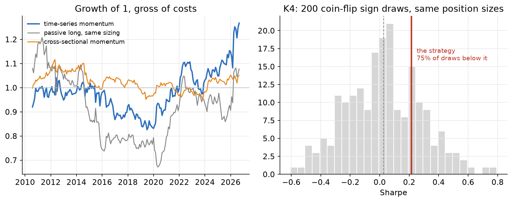
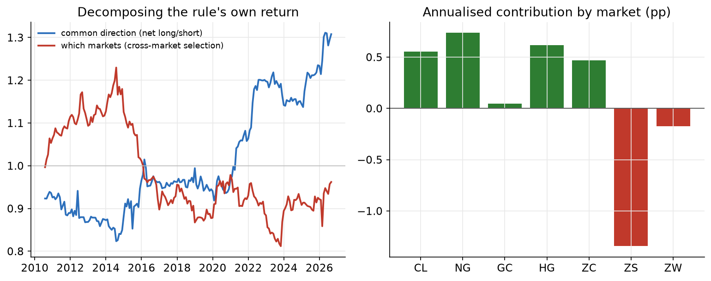
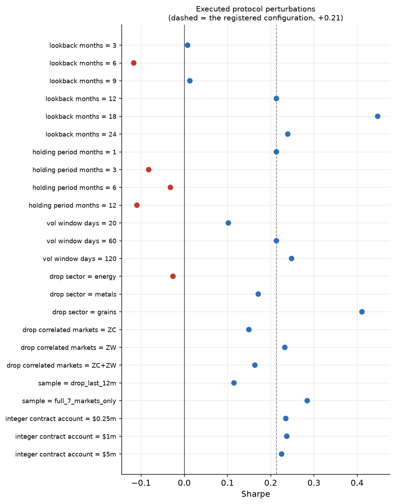

# Time-series momentum in futures

**Claim audited.** Moskowitz, Ooi and Pedersen (2012) report that the sign of a futures market's own trailing 12-month excess return predicts its next month, across 58 instruments and four asset classes, strongly enough that a volatility-scaled, equal-weighted portfolio of such positions earns a Sharpe ratio of roughly 1.2 — with positive predictability in every one of the 58 instruments taken individually.

**Verdict.** **Does not survive, on the commodity sleeve, after publication.** All four pre-registered kill criteria fired. Over 193 months from 2010-07-31 to 2026-08-31 on seven commodity futures, the rule as specified returns +1.84% a year at 8.6% volatility — a Sharpe of +0.21 whose bootstrap interval [-0.17, +0.59] contains zero. The decisive test is not that number but K4: replacing the momentum signal with coin flips, while keeping the position sizes the rule chose, places the strategy above 75% of 200 random draws. On this evidence the momentum signal is not distinguishable from random signs under the tested sizing rule.

## What was tested, and against what

The protocol was registered before any of this code existed. It fixed the construction — sign of the trailing 12-month return, inverse-volatility sizing to a 15% per-market budget capped at ±4, equal weight across markets, monthly rebalance, everything lagged one month — and, more importantly, fixed what the rule had to beat.

Three benchmarks, all built from the same panel with the same sizing and the same lag, so any difference between them is a difference in information rather than in plumbing:

| | Sharpe | annualised |
|---|---|---|
| **time-series momentum** | **+0.21** | **+1.84%** |
| passive long, same sizing | +0.10 | +0.98% |
| cross-sectional momentum | +0.10 | +0.38% |
| coin-flip signs, same position sizes | +0.03 (mean of 200) | — |

## K1 — spanning

Regressing the strategy on the two economic benchmarks with HAC standard errors leaves an alpha of +1.57% a year with t = +0.95 over 193 months. Its annualised 95% interval is [-1.68%, +4.82%]; it contains zero, so K1 fires.

The loadings are more interesting than the alpha. Cross-sectional momentum takes a coefficient of +0.957 with t = +4.80: the two rules move together closely. The passive long takes -0.100 with t = -0.62 — essentially nothing.

This is worth stating plainly because it does *not* reproduce the usual criticism of the claim, which is that time-series momentum is cross-sectional momentum plus an inherited net long position. In this sample there was no long premium to inherit: a passive long in these seven markets at the same sizing earned a Sharpe of +0.10 over sixteen years. The rule is not living off the asset class. It is simply not earning.

## K4 — the signal against coin flips

This is the criterion that reads backwards: survival is the death sentence. Each of the 200 draws keeps the strategy's position *magnitudes* — the inverse-volatility scaling, the cap, the equal weighting — and replaces only the signs with fair coin flips. The draws land at a mean Sharpe of +0.03 with a 5–95 band of [-0.38, +0.46]. The strategy's +0.21 sits above 75% of them — inside the band, not beyond it.

The decomposition says the same thing from another direction. Splitting the rule's return into the part earned by its time-varying common direction and the part earned by choosing *which* markets to be long:

| | annualised | Sharpe |
|---|---|---|
| common direction (net long/short) | +1.88% | — |
| cross-market selection | -0.04% | -0.01 |

Everything the rule earned came from being net long or net short at the right times; deciding which of the seven markets to favour contributed -0.04% a year. And the contributions are not broadly spread: 2 of the 7 markets contributed negatively, with ZS at -1.34% a year.

## K2 — the sealed block

The most recent block, from 2021-01-01 onward, was sealed and opened once, through the ledger at `results/holdout_ledger.json` (fingerprint `06c0a7fb49b4`). Re-opening it under a changed configuration raises rather than quietly re-running.

Those 67 months are the friendliest stretch in the sample — the inflation-trend period a commodity trend follower is supposed to own. The rule returned +5.53% a year there, a Sharpe of +0.61. The interval is [-0.12, +1.21] and contains zero, so K2 fires too. The best sub-period in the sample does not reach conventional significance.

## K3 — costs, and what is not the problem here

Average turnover is 0.26 units of position per market per rebalance, and the gross edge breaks even at 60.1 bps. Charged at a generous 10 bps per unit of absolute position change, the net series has a monthly mean interval [-0.14%, +0.41%], which contains zero, so K3 fires exactly as registered. Its Sharpe is +0.18 with interval [-0.21, +0.56].

But it fires for the wrong-sounding reason, and the distinction matters. Liquid futures cost a few basis points a round turn; a breakeven of 60.1 bps means friction is nowhere near the binding constraint. Unlike a retail options strategy that dies on the spread, this claim is not killed by costs. There is simply not enough gross edge for the interval to clear zero at any plausible cost, including zero cost.

The registered account-space check is now executed using the unadjusted mapped-contract price for sizing, CME contract point values and nearest-integer lots. Dollar P&L uses the prior raw notional times the roll-clean adjusted return; it never treats a raw cross-contract price gap as profit. At the registered 10 bps cost assumption:

| capital | gross Sharpe | net Sharpe | net annual | tracking error | zero-contract targets |
|---:|---:|---:|---:|---:|---:|
| $0.25m | +0.23 | +0.12 | +1.03% | 5.42% | 55.7% |
| $1m | +0.24 | +0.05 | +0.47% | 1.62% | 2.6% |
| $5m | +0.23 | +0.04 | +0.33% | 0.31% | 0.0% |

Granularity matters most at $250k: more than half of otherwise non-zero targets round to zero. By $5m, no target rounds to zero and tracking error is small. None of the gross or net account-space Sharpe intervals excludes zero, so integer implementation does not rescue the claim.

## Robustness, and the number you would have reported

The protocol pre-registered the perturbations, which is the only reason the following is reportable rather than embarrassing. Sweeping the lookback:

| lookback | Sharpe | interval |
|---|---|---|
| 3 months | +0.01 | [-0.46, +0.54] |
| 6 months | -0.12 | [-0.56, +0.34] |
| 9 months | +0.01 | [-0.38, +0.45] |
| 12 months | +0.21 | [-0.17, +0.59] |
| 18 months | +0.45 | [+0.00, +0.83] |
| 24 months | +0.24 | [-0.27, +0.73] |

The registered 12 months is not the peak. 18 months returns +0.45; 6 months returns -0.12. Had the lookback been chosen after seeing the data, the honest-looking thing to report would have been +0.45 at 18 months — roughly double the registered configuration. Its interval is [+0.00, +0.83]. 1 of the 6 lookbacks has an unadjusted interval that excludes zero (18 months); this is reported as sensitivity, not promoted into a replacement specification. The sign is not stable across the pre-registered perturbations (`conclusion_stable_across_perturbations` = False), which is itself evidence against the claim rather than a nuisance.

Dropping a sector moves the result from -0.03 to +0.41 depending on which one goes — removing the grains raises it to +0.41, removing energy takes it to -0.03. Seven correlated markets are not seven independent tests. The most-correlated pair is ZC/ZW at +0.69. Dropping ZC gives +0.15, dropping ZW gives +0.23, and dropping both gives +0.16. The conclusion does not depend on that pair.

Longer holding periods weaken the result: 3, 6 and 12 months give Sharpes of -0.08, -0.03 and -0.11; every interval contains zero. These are overlapping signal vintages with unchanged leverage, not separately tuned strategies.

The registered robustness and implementation protocol is now complete, including integer-contract and multiplier-aware sizing.

## Cross-check against an independent implementation

An earlier, separately written backtest of the same construction — single 12-month signal, inverse-volatility sizing, equal weight, scaled to a 15% portfolio volatility target, the same seven QuantConnect markets from 2009 — reported a Sharpe of +0.11. This run gets +0.21.

The gap is accounted for by two known differences rather than left unexplained: this run starts at 2010-07-31 because the 12-month lookback and the 120-day volatility window are both warmed up first, and it equal-weights across the markets actually available each month rather than requiring all seven. Both implementations land in the same place — a Sharpe near zero, an order of magnitude below the 1.2 the source paper reports — which is the comparison that matters.

## Honest limitations

- **This is the commodity sleeve, not the claim.** Seven commodity futures, not 58 instruments across commodities, equities, bonds and currencies. A large part of the source paper's Sharpe comes from diversifying a weak per-market signal across four asset classes that trend at different times. This run cannot reject the claim as stated for the full universe; it can only say the effect is not present in these seven markets over this period.
- **The whole sample is post-publication.** The source ends in 2009; this begins at 2010-07-31. That makes this a test of whether the effect persisted, not of whether the original finding was correct when it was made. A claim that was true and has since been arbitraged away would produce exactly this result.
- **The panel is unbalanced early.** Only five markets are available until 2011-03 and six until 2012-10; gold's history begins 2012-11. Months before then average over fewer markets. Restricting to the balanced period gives +0.28, so this does not change the conclusion, but the early years are thinner than the market count suggests.
- **One large move could not be corroborated.** Crude in March 2026 moves +54% in a month in this panel. Three other outliers in the sample (crude in March and May 2020, natural gas in July 2022) match known events; this one was not checked against a second data source. Dropping the last twelve months gives +0.11, so the conclusion does not rest on it.
- **The coin-flip comparison is gross only.** Independent monthly sign draws turn over far more than the strategy does, so the random book would pay more in costs than the rule it is being compared with. Charging both would widen the gap in the strategy's favour — but the gap being tested is against the *gross* distribution, and the strategy sits inside it there.
- **Account-space sizing is deliberately conservative.** Without historical mapped contract identifiers, turnover assumes a full close and reopen at every monthly rebalance. This cannot hide roll costs but may overcharge months with no roll. Margin, capacity and time-varying exchange fees remain outside the calculation.
- **K4's percentile has 200-draw resolution.** The reported 75% is accurate to about half a percent, which is far finer than the margin by which the criterion is decided, but the number should not be read as more precise than that.
- **Registered implementation completeness is not a capacity claim.** Every listed protocol clause is executed, but the result remains a seven-market research portfolio rather than a broker- or venue-specific executable book.

## What would have changed the verdict

Three things together, all fixed in advance: an alpha in the spanning regression with |t| > 2 rather than the +0.95 observed; the strategy above the 95th percentile of the sign-randomised draws rather than above only 75% of them; and a Sharpe whose sign held across the pre-registered lookback and volatility-window sweeps. Any one of the three alone would have been suggestive; the protocol required all three because each of them has a well-known way of being produced by accident.

## Provenance and reproduction

- Panel: QuantConnect native continuous futures, OpenInterest mapping, BackwardsRatio normalization, depth offset 0 — the roll settings validated in the source CTA project against an independently constructed continuous series.
- Export: `cases/tsmom/qc_export.py`, month-end, 2010–2026, md5-checked on decode by `cases/tsmom/decode_panel.py`.
- Execution: `cases/tsmom/run.py`. Figures: `cases/tsmom/make_figures.py`. This document: `cases/tsmom/make_report.py`, every number interpolated from `results.json`.
- Known-answer controls: `cases/tsmom/validate.py`, four synthetic worlds including a positive control the apparatus must pass; also gate `tsmom-controls` in `scripts/regress.py`.
- Sealed block opened once at fingerprint `06c0a7fb49b4`, recorded in `cases/tsmom/results/holdout_ledger.json`.
- Account sizing uses Raw OpenInterest-mapped prices and CME standard contract units: CL 1,000 barrels; NG 10,000 MMBtu; GC 100 troy ounces; HG 25,000 pounds; ZC/ZS/ZW 5,000 bushels.
