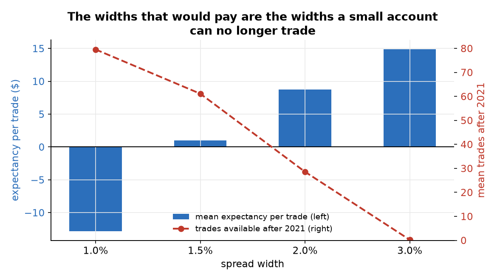
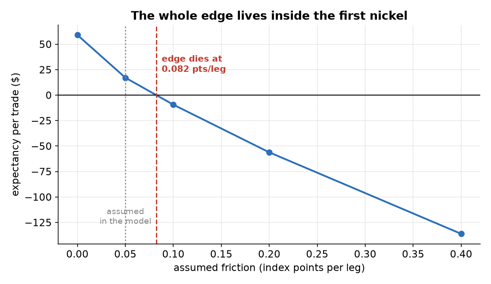
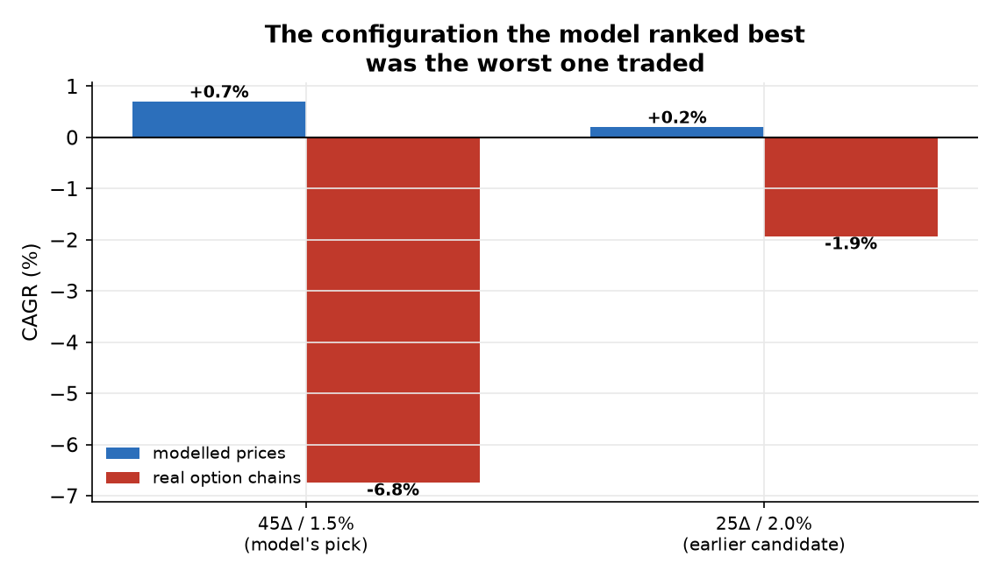

# Harvesting the Volatility Risk Premium at Retail Scale

**Claim audited.** The volatility risk premium is real and persistent, so a small account can harvest it by systematically selling defined-risk index option spreads — capped loss, high win rate, a premium collected for bearing a risk that usually does not materialize.

**Verdict.** Falsified. The premise holds and the conclusion does not follow. On real option chains with conservative fills the model's own chosen configuration returned -43.9% net (-6.75% CAGR) against a modelled +0.7%, and every configuration tested was negative. The mechanism is not bad luck: the modelled edge crosses zero at 0.082 index points of friction per leg, so the entire result was living inside a spread assumption that only real quotes could settle. A true premise, a real premium, and no way to reach it from here.

## A premise that is actually true

Most audits in this library begin with a claim that turns out to rest on nothing. This one
begins with a premise that is true. Implied volatility exceeds subsequently realized
volatility by about 3.4 volatility points on average and does so
about 82% of the time. Sellers of index options are paid a real
premium for bearing a real risk.

The claim under audit is the step everyone takes next: that a small account can therefore
harvest it, using defined-risk spreads so that a crash costs a capped amount rather than
the account. The claim is not that the premium exists. It is that it is reachable from
here, after costs, at this size.

The evidence is a modelled search over 108
configurations — strike, width, stop rule, holding period, entry filters, priced with a
model rather than with real quotes — and then the three configurations that were carried
to real option chains with conservative fills.

## Re-executing the selection rule

The source study wrote its selection rule down before inspecting the grid: keep only
configurations that still traded at least 10 times after 2021 and had positive
expectancy, then rank by Sharpe. Re-executing that rule here on the ungated
configurations leaves 3 eligible out of 12, and
ranks first the **0.45-delta, 2.0%-wide** configuration
(Sharpe 0.33, $22.6 per trade).

The configuration actually carried forward was the 45-delta short leg
at **1.5% width** — the runner-up. The reason is documented in the source study and it is
a good one: the 2.0% width traded only
56 times after
2021 against
81 for the
1.5%, and its entries had stopped well before the sample ended, so the higher Sharpe was
being earned in an intermittent window that a live account could not rely on. Both were
eventually tested against real chains anyway.

It is still a discretionary override of a pre-registered rule, and this audit records it
as one. The override was conservative, it was disclosed, and it did not change the
verdict — which is the most that can be said for any deviation, and worth saying plainly
rather than leaving the reader to assume the rule ran unaided.

## Two structural findings from the grid

Two structural findings come out of the grid, and neither depends on which configuration
was picked.

**A high win rate is not profit.** Across all 108 configurations the
correlation between win rate and expectancy is only +0.48. Of the
30 configurations that win at least 85% of their trades,
57% lose money. The highest win rate in the entire grid is
92.9% — and it earns $-1.7 per
trade. Selling far out-of-the-money options buys a long run of small wins at the price of
occasional losses that erase them, and the win rate is the number that hides it.

**Position granularity decides what is tradable, and it works against the account.** A
small account sizing to a fixed maximum loss per trade can only sell so wide before a
single contract breaches the risk budget. Mean expectancy rises monotonically with
width — -12.8 dollars at 1.0%, +1.0 at
1.5%, +14.9 at 3.0% — while the number of trades the account can
actually take collapses in the opposite direction, from
80 after 2021 down to 0.
The widths that would pay are the widths this account can no longer trade.

## The friction cliff

The modelled winner earns $+17.1 per trade at the assumed friction of
0.05 index points per leg. Sweep that assumption and the number
does not degrade gracefully — it crosses zero at
**0.082 points per leg**, which is
0.032 points of headroom above what was assumed, and reaches
$-9.4 at a tenth of a point.

The entire edge lives inside the first nickel of transaction cost. That is not a
robustness caveat; it is the finding. A strategy whose profitability is decided by
whether the effective spread is five cents or eight is not a strategy with a thin margin,
it is a strategy whose margin *is* the spread assumption — and no model can settle a
spread assumption. Only quotes can.

## Modelled prices against real chains

Three configurations were run against real chains with conservative fills — selling at
the bid and buying at the ask, which is what a small account actually receives.

| configuration | modelled | real chains |
|---|---|---|
| 45-delta short leg / 1.5% wide / no stop / 35 DTE | +0.7% CAGR, $+17.1/trade | **-43.9% net, -6.75% CAGR** |
| 25-delta short leg / 2.0% wide | +0.2% CAGR, $+5.2/trade | **-14.5% net, -1.94% CAGR** |

The ranking inverted. The configuration the model ranked as the only feasible positive
one in the whole search was the *worst* of those traded, by a factor of three. A
single-leg variant with the least friction of any structure in the family reached a
+3.0%
CAGR and still underperformed cash — an upper bound on the whole family, established
independently.

Why the model ranked it best is also why reality ranked it worst. A near-the-money short
leg collects the most premium, which is what the model rewards; it is also the most often
breached and, in a narrow spread, the one that pays the most bid-ask relative to the
credit collected. The model priced the premium and could not price the execution.

## Honest limitations

- The real-chain results are recorded, not recomputed here. They were produced on the data vendor's backtesting platform and the raw logs were not saved to the source repository; the figures come from that project's stated authority documents and are pinned in `data/realchain_results.json`. This case can re-derive the modelled grid's structure but not the adjudicating runs.
- The friction sensitivity curve is likewise a recorded table from the source study, not re-run here; the breakeven point this case computes is an interpolation of that table. Its shape is not linear, because friction changes which trades are taken as well as what they earn, so the interpolation is an approximation between measured points.
- The modelled prices use Black-Scholes with a fixed skew multiplier. That is adequate for ranking magnitudes and for tail structure and it is not adequate for a verdict — which is precisely what the real-chain runs demonstrated by inverting the ranking.
- The selection rule was re-executed and it did not pick the configuration that was carried forward; the override is documented and defensible but it is an override, and the pre-registration is weaker for it.
- Only three configurations were ever tested against real chains. The conclusion that the family is unharvestable rests on those three plus the friction argument, not on an exhaustive live test of all 108.
- The whole analysis is scaled to one small account with a fixed per-trade risk budget. The granularity findings are specific to that size and would not transfer to an account large enough to trade the wider spreads.
- Index level matters: the widths that were feasible depend on where the index traded during the sample, so the feasibility boundary is not a constant.

## What would have changed the verdict

The audit could have come out the other way at several points and did not. Had the premise been false, the volatility premium would not have measured 3.4 points positive 82% of the time — it does. Had the edge been robust rather than marginal, the friction sweep would have shown expectancy surviving to a tenth of a point — it turns negative at 0.082. And had the modelled prices been good enough to adjudicate, the real-chain ranking would have agreed with the modelled one instead of inverting it.

## Provenance and reproduction

- Pinned in `data/`: the two modelled configuration grids from the source study (72 and 36 configurations), and the recorded real-chain results plus friction sensitivity table with their provenance.
- Reproduce with `micromamba run -n verdict python cases/vol_harvest/run.py`, then `make_figures.py`, then `make_report.py`. Offline, CPU, seconds.
- Every number in this document is interpolated from `results.json`.
- Framework components exercised: `costs.breakeven_friction` (the cliff), `robust`-style grid aggregation for the feasibility and delta gradients, and the re-execution of the documented selection rule.
